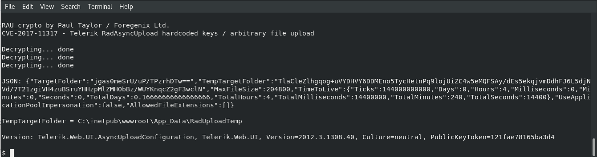
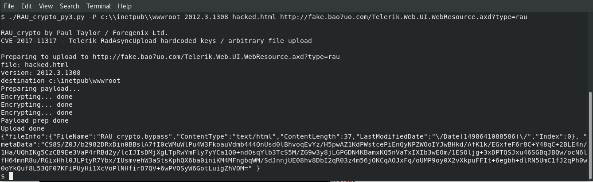

# RAU_crypto
[](https://www.python.org)

Hard-coded encryption key remote file upload exploit for CVE-2017-11317, CVE-2017-11357 (Telerik UI for ASP.NET AJAX). Allows for straightforward decryption and encryption of the rauPostData used with Telerik.Web.UI.WebResource.axd?type=rau and resulting in arbitrary file uploads. The exploit will automatically upload the file.

## Requirements
- python >= 3.6 with pycryptodome (https://blog.sqreen.io/stop-using-pycrypto-use-pycryptodome/)

## Published on exploit-db
- https://www.exploit-db.com/exploits/43874/

## See also

My other Telerik UI exploit (for CVE-2017-9248) will probably also be of interest. It is available here:
- https://github.com/bao7uo/dp_crypto

## To do
- [x] Missing HMAC functionality for later versions.
- [ ] Ability to specify custom key.
- [ ] Brute force versions.

## Vulnerabilities
The CVE-2017-11317 vulnerability was discovered by others. Shortly after it was announced, I encountered the Telerik library during the course of my work, so I researched it and the vulnerability and wrote this exploit in July 2017. I also reported CVE-2017-11357 for the related insecure direct object reference.

https://www.telerik.com/support/kb/aspnet-ajax/upload-%28async%29/details/insecure-direct-object-reference

## Usage
```
$ ./RAU_crypto_py3.py 

RAU_crypto by Paul Taylor / @bao7uo 
CVE-2017-11317 - Telerik RadAsyncUpload hardcoded keys / arbitrary file upload

Usage:

Decrypt a ciphertext:               -d ciphertext
Decrypt rauPostData:                -D rauPostData
Encrypt a plaintext:                -e plaintext

Generate file upload rauPostData:   -E c:\\destination\\folder Version
Generate all file upload POST data: -p c:\\destination\\folder Version ../local/filename
Upload file:                        -P c:\\destination\\folder Version c:\\local\\filename url [proxy]

Generate custom payload POST data : -c partA partB
Send custom payload:                -c partA partB url [proxy]

Version in HTTP response:           -v url [proxy]

Example URL:               http://target/Telerik.Web.UI.WebResource.axd?type=rau
$
```
## Example - decryption


## Example - arbitrary file uplaod


## Custom payloads

For details on custom payloads, there is a great article by [@mwulftange]( https://github.com/mwulftange ) on the Code White blog at the following link.

- https://codewhitesec.blogspot.com/2019/02/telerik-revisited.html

Other relevant links.

- https://www.blackhat.com/docs/us-17/thursday/us-17-Munoz-Friday-The-13th-JSON-Attacks-wp.pdf
- https://threatvector.cylance.com/en_us/home/implications-of-loading-net-assemblies.html

Special thanks to [@irsdl]( https://github.com/irsdl ) who inspired this feature.
